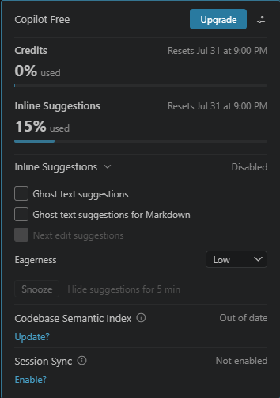

## Ferramentas de IA Utilizadas

Durante o desenvolvimento do projeto foram utilizadas as seguintes ferramentas de IA:

- ChatGPT FREE (principal ferramenta utilizada)
- GitHub Copilot (auxílio em autocomplete e pequenos trechos de código) 
- Documentações oficiais das tecnologias utilizadas. 

O ChatGPT foi utilizado como uma ferramenta de apoio técnico e arquitetural durante todo o desenvolvimento, auxiliando na resolução de problemas específicos, organização do projeto e compreensão de tecnologias que eu ainda não possuía experiência prática, como a implementação de PWA.

A maior parte das vezes evito utilizar o copilot, optando por coloca-lo para dormir, por conta que me dá uma falsa sensação de conhecimento.

Links das documentações utilizadas:
- https://www.typescriptlang.org/docs/
- https://react.dev/
- https://jwt-auth.readthedocs.io/en/develop/
- https://web.dev/learn/pwa/ 